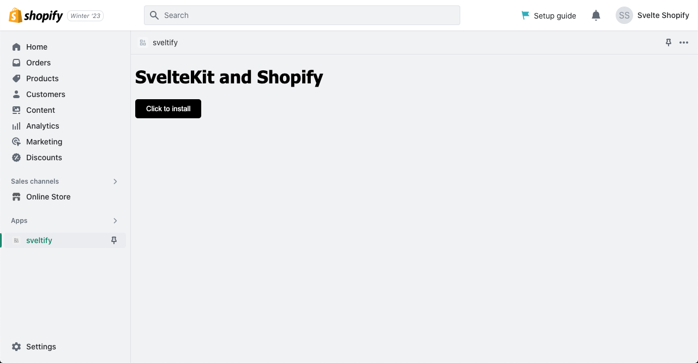

# Shopify Sveltekit App

NOTE 1: App bridge is not used in this code but you're gonna have to add it to render outside of the usual app surface and communicate with the rest of the Shopify admin. More on it here: https://shopify.dev/docs/apps/tools/app-bridge

NOTE2: You'll have to serve over https to work with App bridge, expect pain if you use ngrok (cookies problems)



## How to install

1- clone this repo

```
git clone https://github.com/zitounao/Sveltekit-Shopify-App.git
```

2- create app in shopify partners

» Go to https://www.shopify.com/partners and login

» Go to apps and click create app

» Click create app manually and give it a name

» Copy and paste Client ID and Client secret in .env.example

» Comeback and click on app setup

» Set http://localhost:3000/ in App URL and http://localhost:3000/auth on top of http://localhost:3000/auth/callback in Allowed redirection URL(s)

» Click save and comeback to the overview tab, click on select store where it says Test your app

» Copy the name of your dev store and paste it in .env.example

» If you don't have a dev store create a new one before doing the previous step

3- Once you have everything set in .env.example

```
cp .env.example .env
npm run install
npx prisma push
npm run dev -- --port 3000
```

No need to browse http://localhost:3000 now.

4- Install the app on Shopify admin

Back to shopify partners on the app overview tab click on Select Store where it says Test your app then click on your store.

You should be redirected to http://localhost:3000/ where you will see a button "click to install".

Click it and voila! the app should installed and embedded in your store.
